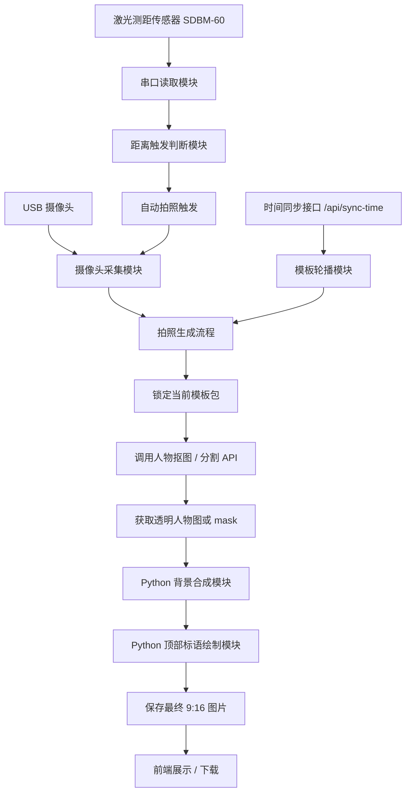
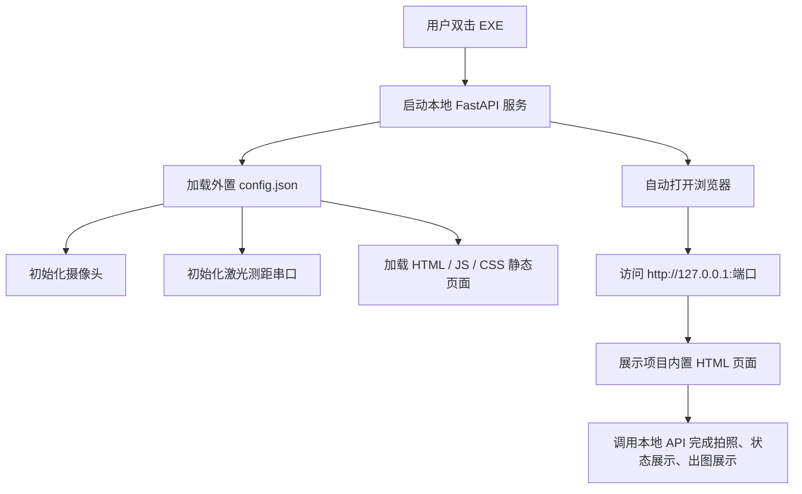

# 摄像头拍照人物抠图换背景与标语合成系统开发文档

## 1. 项目概述

本项目用于实现一个基于 USB 摄像头的拍照生成系统。系统通过摄像头捕捉单人人物照片，调用人物抠图 / 人像分割 API 获取透明背景人物图或人物 mask，然后使用 Python 将人物合成到系统自动选择的背景模板中，并在图片顶部嵌入当前轮播标语，最终生成一张 9:16 竖版宣传照 / 海报图。

本方案采用工程可控性更强的路线：

```text
USB 摄像头拍照
    ↓
锁定当前轮播模板：背景 + 标语
    ↓
调用人物抠图 / 人像分割 API
    ↓
Python 本地替换背景
    ↓
Python 本地嵌入顶部标语
    ↓
输出 9:16 成品图
```

该方案的核心优势是：

- 人物主体保真度高；
- 背景模板选择可控；
- 标语文字准确，不依赖大模型生成文字；
- 人物位置、大小、输出比例、文字样式都可以由程序精确控制；
- 便于后续扩展为后台配置、多模板轮播、二维码下载、打印等能力。

---

## 2. 已确认需求

| 模块 | 需求说明 |
|---|---|
| 摄像头 | USB 摄像头，通过设备号 / 端口配置 |
| 拍照触发 | 激光测距传感器控制拍照信号，目标进入指定距离范围后自动触发拍照 |
| 拍照对象 | 单人拍照 |
| 背景模板 | 多张模板背景，由系统自动选择 |
| 背景选择方式 | 按固定时间间隔自动轮播 |
| 标语 | 一组标语，按固定时间间隔轮播 |
| 时间同步按钮 | 重置轮播起点，从第一个模板重新开始 |
| 图片比例 | 9:16 竖版 |
| 标语位置 | 图片顶部 |
| 额外元素 | 不需要 logo、日期、活动名称 |
| 图像处理路线 | API 完成人物抠图 / 分割，Python 本地替换背景和加字 |
| 配置管理 | 所有关键配置均通过 `config.json` 统一配置 |
| 部署形式 | 项目最终打包为 Windows `.exe` 程序 |
| 页面展示 | 使用项目内置 HTML 页面进行展示，由本地后端服务提供页面访问 |

---

## 3. 推荐技术栈

### 3.1 后端技术

| 技术 | 用途 |
|---|---|
| Python 3.10+ | 主开发语言 |
| FastAPI | 提供接口服务 |
| OpenCV | USB 摄像头读取、拍照 |
| Pillow | 图片合成、加字、缩放、裁切 |
| Requests / HTTPX | 调用人物抠图 API |
| PySerial | 读取激光测距传感器 UART 串口数据 |
| Uvicorn | FastAPI 服务运行 |
| PyInstaller | 将项目打包为 Windows `.exe` 程序 |
| JSON / SQLite | 保存配置、模板、轮播状态 |

### 3.2 前端技术

第一版可以采用简单 Web 页面实现：

| 技术 | 用途 |
|---|---|
| HTML / CSS / JavaScript | 页面展示 |
| Fetch API | 调用后端接口 |
| Web 页面 | 显示当前模板、当前标语、拍照按钮、时间同步按钮、结果图 |

如果后期需要更复杂的管理页面，可升级为 Vue / React。

### 3.3 部署与展示方式

本项目最终部署时，建议采用：

```text
Windows EXE 程序
    ↓
启动本地 FastAPI 服务
    ↓
服务挂载项目内置 HTML 页面
    ↓
自动打开浏览器
    ↓
通过 HTML 页面展示摄像头状态、激光测距状态、当前标语、拍照结果
```

也就是说，用户不需要手动运行 Python 命令，也不需要单独启动前端服务。用户只需要双击 `.exe`，程序会启动本地服务，并打开项目内置 HTML 页面。

---

## 4. 总体架构



### 4.1 EXE 本地展示架构




---

## 5. 核心业务流程

### 5.1 系统启动流程

```text
1. 读取 config.json 配置文件
2. 初始化摄像头设备号
3. 加载背景模板列表
4. 加载标语列表
5. 加载轮播间隔配置
6. 加载字体和文字样式配置
7. 初始化 rotation_start_time
8. 启动 FastAPI 服务
```

---

### 5.2 模板轮播流程

系统将背景模板和标语组成一个“模板包”。

每个模板包包含：

```text
模板 ID
背景图片路径
标语文本
```

轮播规则：

```text
当前索引 = ((当前时间 - 轮播起点时间) // 轮播间隔秒数) % 模板包数量
```

例如：

```text
模板包数量：3
轮播间隔：30 秒

第 0 - 30 秒：模板包 1
第 30 - 60 秒：模板包 2
第 60 - 90 秒：模板包 3
第 90 - 120 秒：模板包 1
```

---

### 5.3 时间同步流程

点击“时间同步”按钮后：

```text
1. 后端接收 /api/sync-time 请求
2. 将当前系统时间写入 rotation_start_time
3. 当前模板包重置为第一个模板包
4. 后续继续按照固定间隔轮播
```

注意：如果后期有多台设备联动，建议以服务器时间为准，不使用前端本地时间。

---

### 5.4 拍照生成流程

```text
1. 激光测距模块持续读取距离数据
2. 目标进入配置的触发距离范围
3. 距离数据连续稳定满足触发条件
4. 系统自动触发摄像头拍照
5. 后端从 USB 摄像头读取当前帧
6. 立即锁定当前模板包
   - 当前背景图片
   - 当前标语
   - 当前模板 ID
   - 当前时间戳
   - 当前触发距离
7. 保存原始拍照图
8. 调用人物抠图 / 分割 API
9. 获得透明人物 PNG 或人物 mask
10. Python 将人物合成到背景模板中
11. Python 在图片顶部绘制锁定的标语
12. 保存最终成品图
13. 返回最终图片地址
```

拍照瞬间必须锁定模板包，不能等 API 处理完成后再读取当前标语，否则会出现标语和背景错位。

---

### 5.5 EXE 启动展示流程

项目打包为 EXE 后，用户使用流程如下：

```text
1. 用户双击 camera_poster_system.exe
2. 程序读取 exe 同级目录下的 config.json
3. 程序创建必要目录，例如 captures、cutouts、final
4. 程序启动本地 FastAPI 服务
5. 程序初始化 USB 摄像头
6. 程序初始化激光测距传感器串口
7. 程序挂载 frontend/index.html 和 static 静态资源
8. 程序自动打开默认浏览器
9. 浏览器访问 http://127.0.0.1:{server.port}
10. 用户通过 HTML 页面查看状态和最终图片
```

如果自动打开浏览器失败，用户可以手动访问：

```text
http://127.0.0.1:10051
```

端口号由 `config.json` 中的 `server.port` 配置。

---

## 6. 模块设计

---

## 6.1 摄像头采集模块

### 职责

- 打开指定 USB 摄像头；
- 支持摄像头设备号配置；
- 支持拍照保存；
- 可选支持实时预览帧输出。

### 配置示例

```json
{
  "camera": {
    "camera_index": 0,
    "width": 1080,
    "height": 1920,
    "fps": 30
  }
}
```

### 说明

- `camera_index=0` 通常表示默认摄像头；
- 如果电脑连接多个 USB 摄像头，可以尝试 `0、1、2、3`；
- 建议启动时检测摄像头是否可用；
- 拍照结果建议统一转为 9:16 竖版，避免后续合成比例不一致。

---

## 6.2 激光测距触发模块

### 职责

激光测距触发模块用于替代或补充前端手动拍照按钮。当传感器检测到目标进入指定距离范围，并且距离数据连续稳定满足触发条件后，系统自动触发摄像头拍照。

### 硬件模块

本项目使用 SDBM-60 系列激光测距模块。根据模块资料，该模块具备以下特征：

| 项目 | 参数 |
|---|---|
| 测距原理 | ITOF，间接飞行时间 |
| 最大测距范围 | 0.03m - 60m，受目标反射率和环境影响 |
| 准确度 | ±3mm |
| 重复精度 | ±2mm |
| 测量频率 | 3Hz 或 20Hz，视型号而定 |
| 激光光源 | 635nm，Class 2 |
| 数据接口 | UART |
| 工作电压 | DC 3.3V |
| 通讯参数 | 19200bps，8 数据位，1 停止位，无校验，无流控 |

### 接线说明

模块引脚如下：

| 引脚 | 名称 | 功能 | 说明 |
|---|---|---|---|
| 1 | PWREN | 信号输入 | 模块通电控制引脚，高电平有效 |
| 2 | TXD | 信号输出 | 串口发送引脚，开漏 open-drain |
| 3 | RXD | 信号输入 | 串口接收引脚，开漏 open-drain |
| 4 | VCC | 电源+ | DC 2.5V - 3.3V，建议 3.3V |
| 5 | GND | 电源地 | 与主控 / USB-TTL 模块共地 |

### 接入建议

如果后端运行在普通 PC 上，建议使用：

```text
SDBM-60 激光测距模块
    ↓
USB 转 TTL 串口模块，3.3V 电平
    ↓
电脑 USB 口
    ↓
Python pyserial 读取串口数据
```

注意事项：

- 不建议直接接 RS232 串口电平；
- 串口电平建议使用 3.3V TTL；
- TXD/RXD 为开漏输出 / 输入，实际接线时应关注上拉电阻和电平兼容；
- VCC 建议使用稳定 3.3V 电源；
- 必须共地；
- 通电接线前应先断电；
- 激光为 Class 2，禁止直视光束；
- 该模块不是安全传感器，不应用作人员保护装置。

### 通讯参数

```text
baudrate: 19200
bytesize: 8
stopbits: 1
parity: none
flowcontrol: none
```

### 常用命令

#### 单次自动测量

```text
AA 00 00 20 00 01 00 00 21
```

#### 单次快速测量

```text
AA 00 00 20 00 01 00 02 23
```

#### 启动连续自动测量

```text
AA 00 00 20 00 01 00 04 25
```

#### 启动连续快速测量

```text
AA 00 00 20 00 01 00 06 27
```

#### 退出连续测量

```text
58
```

即发送一个字节 `0x58`，对应大写字符 `X`。

### 测量结果解析

测量结果返回帧中，距离值位于有效距离字段。文档中返回格式如下：

```text
AA 00 00 22 00 03 AABBCCDD 0101 sum
```

其中：

```text
AABBCCDD：有效距离值
0101：信号质量
sum：校验和
```

实际开发时需要根据返回字节序确认距离值单位和解析顺序。建议先写一个串口调试脚本，打印原始十六进制数据和解析后的距离值，再根据实测结果确定最终解析逻辑。

### 拍照触发规则

建议不要“只要检测到距离就立刻拍照”，否则容易因为抖动、误测、路人经过导致频繁触发。

推荐使用状态机：

```text
IDLE 空闲状态
    ↓ 目标进入触发距离
CANDIDATE 候选状态
    ↓ 连续 N 次距离稳定
TRIGGERED 触发拍照
    ↓ 进入冷却时间
COOLDOWN 冷却状态
    ↓ 冷却结束，目标离开触发区
IDLE 空闲状态
```

### 推荐触发条件

| 条件 | 推荐值 |
|---|---|
| 有效触发距离 | 800mm - 1500mm，可按现场调整 |
| 连续稳定样本数 | 3 - 5 次 |
| 距离波动范围 | ±50mm |
| 拍照冷却时间 | 5 - 10 秒 |
| 触发模式 | 目标进入指定距离范围后触发 |
| 退出条件 | 目标离开触发范围一段时间后重新允许触发 |

### 触发逻辑示例

```text
1. 连续读取激光测距距离值
2. 判断距离是否在 trigger_min_mm 和 trigger_max_mm 之间
3. 如果连续 stable_samples 次都在范围内，并且距离波动小于 stable_delta_mm
4. 触发摄像头拍照
5. 进入 cooldown_ms 冷却期
6. 冷却期内不再重复拍照
7. 冷却结束后，等待目标离开触发区域
8. 目标再次进入后，允许下一次触发
```

---

## 6.3 模板轮播模块

### 职责

- 管理背景模板；
- 管理标语；
- 根据时间计算当前模板；
- 支持时间同步重置；
- 拍照时提供当前模板包。

### 模板包示例

```json
{
  "rotation": {
    "interval_seconds": 30,
    "rotation_start_time": 1746520000
  },
  "templates": [
    {
      "id": "tpl_001",
      "name": "红色宣传模板",
      "background_path": "templates/bg_001.jpg",
      "slogan": "奋进新征程，建功新时代"
    },
    {
      "id": "tpl_002",
      "name": "蓝色科技模板",
      "background_path": "templates/bg_002.jpg",
      "slogan": "凝心聚力谋发展，实干担当谱新篇"
    },
    {
      "id": "tpl_003",
      "name": "活动主题模板",
      "background_path": "templates/bg_003.jpg",
      "slogan": "实干笃行勇争先，奋楫扬帆启新程"
    }
  ]
}
```

---

## 6.4 人物抠图 / 分割 API 模块

### 职责

- 将拍照原图上传到人物抠图 API；
- 获取透明背景人物图或人物 mask；
- 处理 API 异常、超时、失败；
- 保存抠图结果。

### API 返回方式

常见有两种：

#### 方式一：直接返回透明 PNG

这是最推荐的方式。

```text
输入：原始人物照片
输出：透明背景人物 PNG
```

后续 Python 可以直接使用 alpha 通道合成背景。

#### 方式二：返回 mask

```text
输入：原始人物照片
输出：人物 mask
```

后续 Python 需要根据 mask 从原图中提取人物。

---

## 6.5 Python 背景合成模块

### 职责

- 加载当前背景模板；
- 加载透明人物图；
- 将背景统一到 9:16 尺寸；
- 按规则缩放人物；
- 将人物放置到底部居中或合适区域；
- 可选添加轻微阴影、边缘羽化、亮度调整；
- 输出合成图。

### 推荐合成规则

| 项目 | 推荐配置 |
|---|---|
| 输出尺寸 | 1080 × 1920 |
| 人物高度 | 画面高度的 60% - 75% |
| 人物位置 | 底部居中 |
| 顶部区域 | 预留标语空间 |
| 背景处理 | 缩放裁切为 9:16 |
| 人物边缘 | 保持 alpha，自然贴合 |

---

## 6.6 标语绘制模块

### 职责

- 在最终图片顶部绘制标语；
- 支持文字居中；
- 支持字体大小自适应；
- 支持自动换行；
- 支持描边；
- 支持半透明底板；
- 保证标语准确输出。

### 推荐文字样式

| 项目 | 推荐值 |
|---|---|
| 位置 | 顶部居中 |
| 顶部边距 | 80 - 140 px |
| 最大宽度 | 图片宽度的 80% - 88% |
| 字体 | 黑体 / 微软雅黑 / 思源黑体 |
| 字色 | 白色 |
| 描边 | 黑色或深红色 |
| 描边宽度 | 2 - 4 px |
| 行数 | 最多 2 行 |
| 背景底板 | 可选，半透明深色 |

---

## 6.7 HTML 展示模块

### 职责

HTML 展示模块用于作为项目的前端展示页面。该页面不单独部署，而是作为项目静态资源随 EXE 一起打包或放置在 EXE 同级目录中，由本地 FastAPI 服务提供访问。

### 页面内容

页面建议包含以下区域：

```text
1. 摄像头预览区域
2. 激光测距状态区域
3. 当前距离值
4. 当前触发状态
5. 当前轮播标语
6. 当前模板名称
7. 距离下一次模板切换剩余秒数
8. 时间同步按钮
9. 手动拍照按钮，调试 / 兜底使用
10. 最新生成图片展示区域
11. 下载最终图片按钮
```

### 页面调用接口

HTML 页面通过 `fetch` 调用本地接口：

```text
GET  /api/current-template
GET  /api/laser-status
POST /api/sync-time
POST /api/capture
GET  /api/task/{task_id}
```

### 页面访问方式

由后端提供根路由：

```text
GET /
```

返回：

```text
frontend/index.html
```

同时挂载静态资源：

```text
/static
/frontend
```

### 推荐前端结构

```text
frontend/
  index.html
  app.js
  style.css
```

第一版不建议引入复杂构建工具，直接使用原生 HTML、CSS、JavaScript 即可，方便 PyInstaller 打包。

---

## 6.8 EXE 打包部署模块

### 职责

EXE 打包部署模块用于将 Python 后端、HTML 页面、静态资源、默认配置、字体文件等内容打包成可在 Windows 上直接运行的程序。

### 推荐打包方式

建议优先使用 PyInstaller 的 `onedir` 模式，而不是 `onefile` 模式。

#### 推荐：onedir 模式

```text
dist/
  camera_poster_system/
    camera_poster_system.exe
    config.json
    frontend/
    static/
    fonts/
```

优点：

- 配置文件可直接修改；
- 背景模板可直接替换；
- 字体文件可直接替换；
- 输出图片目录可直接查看；
- OpenCV、Pillow、PySerial 等依赖更容易稳定运行；
- 现场部署和排错更方便。

#### 可选：onefile 模式

`onefile` 可以生成单个 EXE，但不推荐第一版使用。

原因：

- 静态资源路径处理更复杂；
- 每次运行会解压临时目录；
- `config.json`、模板背景、字体等外部资源管理不方便；
- 摄像头、串口、OpenCV 相关依赖排错更困难。

### EXE 启动逻辑

程序入口建议使用 `run_app.py`，负责：

```text
1. 解析运行目录
2. 加载 config.json
3. 创建输出目录
4. 启动 FastAPI
5. 初始化摄像头和激光测距模块
6. 自动打开浏览器
```

### 资源路径原则

打包后，程序需要同时支持：

```text
开发环境运行：python run_app.py
打包环境运行：camera_poster_system.exe
```

因此不能直接使用相对路径硬编码，建议统一封装路径函数。

推荐逻辑：

```python
from pathlib import Path
import sys

def get_base_dir() -> Path:
    if getattr(sys, "frozen", False):
        # EXE 运行时，使用 exe 所在目录
        return Path(sys.executable).resolve().parent
    else:
        # 源码运行时，使用项目根目录
        return Path(__file__).resolve().parent
```

配置文件读取：

```python
BASE_DIR = get_base_dir()
CONFIG_PATH = BASE_DIR / "config.json"
```

### HTML 资源挂载示例

```python
from fastapi import FastAPI
from fastapi.responses import FileResponse
from fastapi.staticfiles import StaticFiles

app = FastAPI()

BASE_DIR = get_base_dir()

app.mount("/static", StaticFiles(directory=BASE_DIR / "static"), name="static")
app.mount("/frontend", StaticFiles(directory=BASE_DIR / "frontend"), name="frontend")

@app.get("/")
def index():
    return FileResponse(BASE_DIR / "frontend" / "index.html")
```

### 自动打开浏览器

```python
import threading
import time
import webbrowser

def open_browser_later(url: str, delay: float = 1.5):
    def _open():
        time.sleep(delay)
        webbrowser.open(url)
    threading.Thread(target=_open, daemon=True).start()
```

启动服务前调用：

```python
open_browser_later("http://127.0.0.1:10051")
```

### 本地服务端口

服务端口应由 `config.json` 控制：

```json
{
  "server": {
    "host": "127.0.0.1",
    "port": 10051,
    "auto_open_browser": true
  }
}
```

### 打包命令示例

开发环境安装依赖：

```bash
pip install fastapi uvicorn opencv-python pillow requests pyserial pyinstaller
```

执行打包：

```bash
pyinstaller ^
  --noconfirm ^
  --onedir ^
  --name camera_poster_system ^
  --add-data "frontend;frontend" ^
  --add-data "static;static" ^
  --add-data "fonts;fonts" ^
  --add-data "config.json;." ^
  run_app.py
```

如果使用 PowerShell，可以写成一行：

```powershell
pyinstaller --noconfirm --onedir --name camera_poster_system --add-data "frontend;frontend" --add-data "static;static" --add-data "fonts;fonts" --add-data "config.json;." run_app.py
```

### 打包后目录建议

```text
dist/
  camera_poster_system/
    camera_poster_system.exe
    config.json
    frontend/
      index.html
      app.js
      style.css
    static/
      templates/
        bg_001.jpg
        bg_002.jpg
      captures/
      cutouts/
      composed/
      final/
    fonts/
      default.ttf
```

### 部署步骤

```text
1. 将 dist/camera_poster_system 整个文件夹复制到目标电脑
2. 修改 config.json
   - 摄像头设备号
   - 激光测距串口，例如 COM3
   - 背景模板
   - 标语内容
   - 轮播间隔
   - 字体样式
3. 双击 camera_poster_system.exe
4. 浏览器自动打开展示页面
5. 进入现场测试
```

### 常见问题

| 问题 | 可能原因 | 处理方式 |
|---|---|---|
| EXE 打开后页面无法访问 | 服务未启动或端口被占用 | 修改 `server.port` |
| 浏览器没有自动打开 | 系统默认浏览器异常或被拦截 | 手动访问本地地址 |
| 摄像头打不开 | `camera_index` 错误或摄像头被占用 | 修改设备号，关闭其他占用程序 |
| 激光串口打不开 | `serial_port` 错误或串口被占用 | 检查设备管理器 COM 口 |
| 背景图加载失败 | 路径错误或文件缺失 | 检查 `static/templates` |
| 字体加载失败 | 字体文件缺失 | 检查 `fonts/default.ttf` |
| 图片无法保存 | 目录权限不足 | 确保程序目录有写入权限 |

---

## 7. 接口设计

---

## 7.1 页面入口

### 接口

```http
GET /
```

### 功能

返回项目内置 HTML 展示页面：

```text
frontend/index.html
```

### 用途

用户双击 EXE 后，程序自动打开浏览器访问该页面。

---

## 7.2 获取当前模板状态

### 接口

```http
GET /api/current-template
```

### 返回示例

```json
{
  "code": 0,
  "message": "success",
  "data": {
    "template_id": "tpl_001",
    "template_name": "红色宣传模板",
    "background_url": "/static/templates/bg_001.jpg",
    "slogan": "奋进新征程，建功新时代",
    "seconds_to_next": 18,
    "interval_seconds": 30
  }
}
```

### 用途

前端展示当前模板、当前标语和距离下一次切换的剩余时间。

---

## 7.3 获取激光测距状态

### 接口

```http
GET /api/laser-status
```

### 返回示例

```json
{
  "code": 0,
  "message": "success",
  "data": {
    "enabled": true,
    "connected": true,
    "serial_port": "COM3",
    "distance_mm": 1025,
    "in_trigger_range": true,
    "state": "CANDIDATE",
    "stable_count": 3,
    "cooldown_remaining_ms": 0,
    "last_error": null
  }
}
```

### 用途

前端可以展示当前激光测距状态，便于现场调试触发距离和判断是否成功连接传感器。

---

## 7.4 时间同步

### 接口

```http
POST /api/sync-time
```

### 功能

重置轮播起点，使当前模板回到第一个模板包。

### 返回示例

```json
{
  "code": 0,
  "message": "sync success",
  "data": {
    "rotation_start_time": 1746520000,
    "current_template_id": "tpl_001"
  }
}
```

---

## 7.5 拍照生成图片

### 接口

```http
POST /api/capture
```

### 功能

由激光测距传感器自动触发或由前端手动触发，拍摄当前摄像头画面，锁定当前模板包，调用人物抠图 API，并合成最终图片。

### 返回示例

```json
{
  "code": 0,
  "message": "success",
  "data": {
    "task_id": "task_20260506_001",
    "template_id": "tpl_001",
    "slogan": "奋进新征程，建功新时代",
    "original_image_url": "/static/captures/task_20260506_001.jpg",
    "cutout_image_url": "/static/cutouts/task_20260506_001.png",
    "final_image_url": "/static/final/task_20260506_001.jpg"
  }
}
```

第一版可以做同步接口，直接返回最终图。  
如果抠图 API 耗时较长，建议第二版改成异步任务：

```text
POST /api/capture       提交任务
GET /api/task/{task_id} 查询状态
```

---

## 7.6 查询任务状态，可选

### 接口

```http
GET /api/task/{task_id}
```

### 返回示例

```json
{
  "code": 0,
  "message": "success",
  "data": {
    "task_id": "task_20260506_001",
    "status": "done",
    "final_image_url": "/static/final/task_20260506_001.jpg"
  }
}
```

---

## 8. 配置文件设计

本项目要求：**所有关键配置均通过 `config.json` 统一配置**。

也就是说，后续不建议把摄像头设备号、背景路径、标语内容、轮播间隔、输出尺寸、字体样式、人物位置、抠图 API 地址等内容写死在代码中，而是统一放入 `config.json`。程序启动时读取配置，运行过程中根据配置执行对应逻辑。

这样做的好处是：

- 更换 USB 摄像头时，只需要修改配置；
- 新增 / 删除背景模板时，不需要修改代码；
- 修改标语内容和轮播间隔时，不需要重新开发；
- 调整人物大小、位置、底部边距时，可以快速验证效果；
- 修改字体、字号、描边、顶部边距时，可以直接调配置；
- 切换人物抠图 API 时，只需要修改 API 配置；
- 便于后期扩展后台管理页面。


```json
{
  "system": {
    "project_name": "camera_poster_system",
    "debug": true,
    "timezone": "Asia/Shanghai"
  },
  "server": {
    "host": "127.0.0.1",
    "port": 10051,
    "auto_open_browser": true,
    "open_browser_delay_seconds": 1.5
  },
  "camera": {
    "camera_index": 0,
    "width": 1080,
    "height": 1920,
    "fps": 30,
    "warmup_frames": 5,
    "mirror_preview": false,
    "auto_rotate": false
  },
  "laser_trigger": {
    "enabled": true,
    "serial_port": "COM3",
    "baudrate": 19200,
    "bytesize": 8,
    "stopbits": 1,
    "parity": "N",
    "timeout_seconds": 0.2,
    "module_address": "0x00",
    "measure_mode": "continuous_fast",
    "start_command_hex": "AA0000200001000627",
    "stop_command_hex": "58",
    "distance_unit": "mm",
    "trigger_min_mm": 800,
    "trigger_max_mm": 1500,
    "stable_samples": 4,
    "stable_delta_mm": 50,
    "cooldown_ms": 8000,
    "require_leave_before_retrigger": true,
    "leave_min_mm": 1800,
    "invalid_distance_policy": "ignore",
    "log_raw_frame": true
  },
  "output": {
    "width": 1080,
    "height": 1920,
    "aspect_ratio": "9:16",
    "format": "jpg",
    "quality": 95
  },
  "rotation": {
    "interval_seconds": 30,
    "rotation_start_time": 1746520000,
    "reset_to_first_template_on_sync": true
  },
  "matting_api": {
    "provider": "custom",
    "api_url": "https://example.com/api/matting",
    "api_key_env": "MATTING_API_KEY",
    "timeout_seconds": 60,
    "return_type": "transparent_png",
    "retry_times": 2
  },
  "paths": {
    "template_dir": "static/templates",
    "capture_dir": "static/captures",
    "cutout_dir": "static/cutouts",
    "composed_dir": "static/composed",
    "final_dir": "static/final",
    "font_dir": "fonts"
  },
  "text_style": {
    "position": "top_center",
    "font_path": "fonts/default.ttf",
    "font_size": 72,
    "min_font_size": 44,
    "font_color": "#FFFFFF",
    "stroke_color": "#000000",
    "stroke_width": 3,
    "top_margin": 100,
    "max_width_ratio": 0.86,
    "max_lines": 2,
    "line_spacing": 12,
    "enable_background_box": true,
    "background_box_color": "#000000",
    "background_box_opacity": 0.35,
    "background_box_padding_x": 36,
    "background_box_padding_y": 20,
    "background_box_radius": 20
  },
  "person_layout": {
    "target_height_ratio": 0.68,
    "bottom_margin": 120,
    "center_x_ratio": 0.5,
    "enable_shadow": true,
    "shadow_offset_x": 0,
    "shadow_offset_y": 18,
    "shadow_blur_radius": 24,
    "shadow_opacity": 0.25
  },
  "templates": [
    {
      "id": "tpl_001",
      "name": "红色宣传模板",
      "background_path": "static/templates/bg_001.jpg",
      "slogan": "奋进新征程，建功新时代",
      "enabled": true
    },
    {
      "id": "tpl_002",
      "name": "蓝色科技模板",
      "background_path": "static/templates/bg_002.jpg",
      "slogan": "凝心聚力谋发展，实干担当谱新篇",
      "enabled": true
    }
  ]
}
```

注意：实际 API Key 不建议写死在代码仓库中，可以使用环境变量或 `.env` 文件管理。`config.json` 中建议只保存环境变量名称，例如 `api_key_env`。

### 8.1 配置项说明

| 配置块 | 说明 |
|---|---|
| `system` | 系统名称、调试模式、时区等基础配置 |
| `server` | 本地服务地址、端口、是否自动打开浏览器 |
| `camera` | USB 摄像头设备号、分辨率、帧率、预热帧数、是否镜像等 |
| `laser_trigger` | 激光测距传感器串口、测量模式、触发距离、稳定样本数、冷却时间 |
| `output` | 最终图片尺寸、比例、格式、质量 |
| `rotation` | 模板轮播间隔、轮播起点、同步按钮行为 |
| `matting_api` | 人物抠图 API 地址、超时时间、返回类型、重试次数 |
| `paths` | 背景模板、原图、抠图图、合成图、最终图、字体文件目录 |
| `text_style` | 顶部标语字体、字号、颜色、描边、自动换行、半透明底板 |
| `person_layout` | 人物缩放比例、底部边距、水平位置、阴影效果 |
| `templates` | 背景模板和标语的绑定关系 |

### 8.2 必须配置化的关键项

以下内容不建议写死在代码中，必须从 `config.json` 读取：

```text
本地服务端口 server.port
是否自动打开浏览器 server.auto_open_browser
摄像头设备号 camera_index
摄像头分辨率 width / height
激光测距串口 serial_port
激光测距波特率 baudrate
激光触发距离 trigger_min_mm / trigger_max_mm
激光触发稳定样本数 stable_samples
拍照冷却时间 cooldown_ms
输出图片尺寸 output.width / output.height
轮播间隔 interval_seconds
轮播起点 rotation_start_time
背景模板列表 templates
标语内容 slogan
抠图 API 地址 api_url
抠图 API 超时时间 timeout_seconds
图片存储路径 paths
字体文件路径 font_path
顶部文字样式 text_style
人物缩放和位置 person_layout
```


---

## 9. 推荐项目目录结构

```text
camera_poster_system/
  run_app.py                   # EXE 启动入口，负责启动服务和打开 HTML 页面
  app/
    main.py                    # FastAPI 入口
    config.py                  # 配置读取
    camera_service.py           # 摄像头采集
    laser_service.py            # 激光测距串口读取与触发判断
    rotation_service.py         # 模板轮播和时间同步
    matting_service.py          # 人物抠图 API 调用
    compose_service.py          # 背景合成
    text_service.py             # 标语绘制
    task_service.py             # 任务管理，可选
    utils/
      image_utils.py
      file_utils.py

  static/
    templates/                  # 背景模板
      bg_001.jpg
      bg_002.jpg
    captures/                   # 原始拍照图
    cutouts/                    # 人物抠图图
    composed/                   # 未加字合成图
    final/                      # 最终成品图

  fonts/
    default.ttf                 # 字体文件，由实际部署环境提供

  frontend/
    index.html                 # 项目内置展示页面
    app.js
    style.css

  config.json                  # 所有关键配置，打包后仍可外置修改
  requirements.txt
  camera_poster_system.spec    # PyInstaller 打包配置，可选
  README.md

  dist/
    camera_poster_system/
      camera_poster_system.exe
      config.json
      frontend/
      static/
      fonts/
```

---

## 10. 核心代码逻辑示例

以下代码仅作为开发逻辑参考，具体 API 参数需要根据实际抠图服务调整。

---

### 10.1 获取当前模板索引

```python
import time

def get_current_template(config: dict) -> dict:
    templates = config["templates"]
    interval = config["rotation"]["interval_seconds"]
    start_time = config["rotation"]["rotation_start_time"]

    now = int(time.time())
    index = ((now - start_time) // interval) % len(templates)
    seconds_to_next = interval - ((now - start_time) % interval)

    current = templates[index]
    return {
        "template": current,
        "index": index,
        "seconds_to_next": seconds_to_next
    }
```

---

### 10.2 时间同步

```python
import time

def sync_rotation_start_time(config: dict) -> dict:
    config["rotation"]["rotation_start_time"] = int(time.time())
    # 实际项目中需要写回 config.json 或状态存储
    return config
```

---

### 10.3 EXE 启动入口示例

建议新增 `run_app.py` 作为程序启动入口。

```python
import threading
import time
import webbrowser
from pathlib import Path
import sys

import uvicorn

from app.main import app
from app.config import load_config


def get_base_dir() -> Path:
    if getattr(sys, "frozen", False):
        return Path(sys.executable).resolve().parent
    return Path(__file__).resolve().parent


def open_browser_later(url: str, delay: float):
    def _open():
        time.sleep(delay)
        webbrowser.open(url)

    threading.Thread(target=_open, daemon=True).start()


def main():
    base_dir = get_base_dir()
    config = load_config(base_dir / "config.json")

    host = config["server"]["host"]
    port = int(config["server"]["port"])

    if config["server"].get("auto_open_browser", True):
        delay = float(config["server"].get("open_browser_delay_seconds", 1.5))
        open_browser_later(f"http://{host}:{port}", delay)

    uvicorn.run(
        app,
        host=host,
        port=port,
        reload=False,
        access_log=False
    )


if __name__ == "__main__":
    main()
```

注意：打包为 EXE 时不要使用 `reload=True`。

---

### 10.4 激光测距触发逻辑示例

```python
import time
import serial
from collections import deque

class LaserTrigger:
    def __init__(self, config: dict):
        cfg = config["laser_trigger"]
        self.enabled = cfg["enabled"]
        self.serial_port = cfg["serial_port"]
        self.baudrate = cfg["baudrate"]
        self.timeout = cfg["timeout_seconds"]

        self.trigger_min = cfg["trigger_min_mm"]
        self.trigger_max = cfg["trigger_max_mm"]
        self.stable_samples = cfg["stable_samples"]
        self.stable_delta = cfg["stable_delta_mm"]
        self.cooldown_ms = cfg["cooldown_ms"]
        self.require_leave = cfg["require_leave_before_retrigger"]
        self.leave_min = cfg["leave_min_mm"]

        self.history = deque(maxlen=self.stable_samples)
        self.last_trigger_time = 0
        self.need_leave = False

        self.ser = serial.Serial(
            port=self.serial_port,
            baudrate=self.baudrate,
            bytesize=8,
            parity="N",
            stopbits=1,
            timeout=self.timeout
        )

    def is_in_range(self, distance_mm: int) -> bool:
        return self.trigger_min <= distance_mm <= self.trigger_max

    def is_stable(self) -> bool:
        if len(self.history) < self.stable_samples:
            return False
        return max(self.history) - min(self.history) <= self.stable_delta

    def can_trigger_now(self) -> bool:
        now_ms = int(time.time() * 1000)
        return now_ms - self.last_trigger_time >= self.cooldown_ms

    def update(self, distance_mm: int) -> bool:
        """
        返回 True 表示触发拍照。
        """
        if distance_mm is None:
            return False

        # 如果配置为必须离开触发区后才能再次触发
        if self.need_leave:
            if distance_mm >= self.leave_min:
                self.need_leave = False
                self.history.clear()
            else:
                return False

        if not self.is_in_range(distance_mm):
            self.history.clear()
            return False

        self.history.append(distance_mm)

        if self.is_stable() and self.can_trigger_now():
            self.last_trigger_time = int(time.time() * 1000)
            if self.require_leave:
                self.need_leave = True
            return True

        return False
```

实际项目中还需要补充：

- 串口原始帧读取；
- 帧头校验；
- 校验和校验；
- 距离字段字节序解析；
- 错误帧处理；
- 串口断开重连。

---

### 10.5 调用人物抠图 API

```python
import requests

def call_matting_api(image_path: str, api_url: str, api_key: str, timeout: int = 60) -> bytes:
    headers = {
        "Authorization": f"Bearer {api_key}"
    }

    with open(image_path, "rb") as f:
        files = {
            "image": f
        }
        response = requests.post(
            api_url,
            headers=headers,
            files=files,
            timeout=timeout
        )

    response.raise_for_status()
    return response.content
```

如果 API 返回 JSON，并且图片是 URL 或 Base64，需要根据实际返回结构调整解析逻辑。

---

### 10.6 Python 背景合成

```python
from PIL import Image
import io

def compose_person_with_background(
    foreground_png_bytes: bytes,
    background_path: str,
    output_path: str,
    output_size=(1080, 1920),
    target_height_ratio=0.68,
    bottom_margin=120
):
    bg = Image.open(background_path).convert("RGBA")
    bg = resize_cover(bg, output_size)

    fg = Image.open(io.BytesIO(foreground_png_bytes)).convert("RGBA")

    target_h = int(output_size[1] * target_height_ratio)
    scale = target_h / fg.height
    target_w = int(fg.width * scale)

    fg = fg.resize((target_w, target_h), Image.LANCZOS)

    x = (output_size[0] - target_w) // 2
    y = output_size[1] - target_h - bottom_margin

    bg.paste(fg, (x, y), fg)
    bg.convert("RGB").save(output_path, quality=95)
```

---

### 10.7 背景按比例裁切为 9:16

```python
from PIL import Image

def resize_cover(img: Image.Image, target_size: tuple[int, int]) -> Image.Image:
    target_w, target_h = target_size
    src_w, src_h = img.size

    scale = max(target_w / src_w, target_h / src_h)
    new_w = int(src_w * scale)
    new_h = int(src_h * scale)

    img = img.resize((new_w, new_h), Image.LANCZOS)

    left = (new_w - target_w) // 2
    top = (new_h - target_h) // 2
    right = left + target_w
    bottom = top + target_h

    return img.crop((left, top, right, bottom))
```

---

### 10.8 顶部绘制标语

```python
from PIL import Image, ImageDraw, ImageFont

def draw_slogan_on_top(
    image_path: str,
    slogan: str,
    output_path: str,
    font_path: str,
    font_size: int = 72,
    top_margin: int = 100,
    font_color: str = "#FFFFFF",
    stroke_color: str = "#000000",
    stroke_width: int = 3
):
    img = Image.open(image_path).convert("RGBA")
    draw = ImageDraw.Draw(img)

    font = ImageFont.truetype(font_path, font_size)

    bbox = draw.textbbox((0, 0), slogan, font=font, stroke_width=stroke_width)
    text_w = bbox[2] - bbox[0]
    text_h = bbox[3] - bbox[1]

    x = (img.width - text_w) // 2
    y = top_margin

    draw.text(
        (x, y),
        slogan,
        font=font,
        fill=font_color,
        stroke_width=stroke_width,
        stroke_fill=stroke_color
    )

    img.convert("RGB").save(output_path, quality=95)
```

第一版可以先不做自动换行；如果标语较长，建议后续增加自动换行和字号自适应。

---

## 11. 前端页面设计

第一版页面建议保持简单：

### 页面元素

```text
1. 当前摄像头预览区域
2. 当前激光测距距离 / 触发状态
3. 当前模板名称
4. 当前标语
5. 距离下一次切换剩余秒数
6. 手动拍照生成按钮，作为调试 / 兜底
7. 时间同步按钮
8. 生成结果展示区
9. 下载按钮
```

### 前端流程

```text
用户双击 EXE
    ↓
自动打开项目内置 HTML 页面
    ↓
页面加载
    ↓
定时请求 /api/current-template 和 /api/laser-status
    ↓
展示当前标语和模板
    ↓
用户点击“拍照生成”
    ↓
调用 /api/capture
    ↓
显示最终图片
```

---

## 12. 异常处理设计

| 异常场景 | 处理方式 |
|---|---|
| 摄像头未连接 | 返回错误提示：摄像头不可用 |
| 摄像头设备号错误 | 提示检查 camera_index |
| 当前无模板 | 提示配置模板数据 |
| 抠图 API 超时 | 返回处理失败，可重试 |
| 抠图 API 返回非图片 | 记录日志，提示接口异常 |
| 人物抠图为空 | 提示未检测到人物或请重新拍照 |
| 背景图不存在 | 提示模板文件缺失 |
| 字体文件不存在 | 使用默认字体或提示配置字体 |
| 标语过长 | 自动缩小字号或换行 |
| 保存图片失败 | 检查目录权限 |

---

## 13. 测试用例

### 13.1 激光测距触发测试

| 编号 | 测试内容 | 预期结果 |
|---|---|---|
| L01 | 配置正确串口 | 能成功打开串口 |
| L02 | 配置错误串口 | 返回传感器不可用 |
| L03 | 目标进入触发距离 | 状态进入 CANDIDATE |
| L04 | 连续稳定满足条件 | 自动触发拍照 |
| L05 | 冷却期内再次进入 | 不重复触发 |
| L06 | 目标离开后再次进入 | 允许下一次触发 |
| L07 | 返回错误帧 | 不触发拍照，并记录错误 |

---

### 13.2 摄像头测试

| 编号 | 测试内容 | 预期结果 |
|---|---|---|
| C01 | 配置 camera_index=0 | 成功打开默认摄像头 |
| C02 | 配置错误 camera_index | 返回摄像头不可用 |
| C03 | 连续拍照 10 次 | 均能成功保存原图 |

---

### 13.3 模板轮播测试

| 编号 | 测试内容 | 预期结果 |
|---|---|---|
| R01 | interval=30 秒 | 每 30 秒切换一次模板 |
| R02 | 点击时间同步 | 立即回到第一个模板 |
| R03 | 拍照时锁定模板 | 最终图使用拍照瞬间的背景和标语 |

---

### 13.4 抠图测试

| 编号 | 测试内容 | 预期结果 |
|---|---|---|
| M01 | 单人正面照片 | 输出完整透明人物图 |
| M02 | 人物靠边照片 | 尽量完整保留人物 |
| M03 | 背景复杂照片 | 人物边缘无明显残留 |
| M04 | 无人照片 | 返回未检测到人物或抠图失败 |

---

### 13.5 合成测试

| 编号 | 测试内容 | 预期结果 |
|---|---|---|
| P01 | 合成 1080×1920 背景 | 输出 9:16 图片 |
| P02 | 人物图过大 | 自动缩放 |
| P03 | 人物图过小 | 自动放大 |
| P04 | 顶部标语绘制 | 文字居中清晰 |

---

### 13.6 EXE 与 HTML 展示测试

| 编号 | 测试内容 | 预期结果 |
|---|---|---|
| E01 | 双击 EXE | 本地服务正常启动 |
| E02 | 自动打开浏览器 | 成功访问 HTML 页面 |
| E03 | 手动访问本地地址 | 可打开 `http://127.0.0.1:10051` |
| E04 | 修改 config.json 后重启 | 配置生效 |
| E05 | 替换背景模板后重启 | 新背景可用 |
| E06 | 页面请求本地 API | 能正常获取模板和激光状态 |
| E07 | EXE 目录无写权限 | 给出保存失败提示 |

---

## 14. 开发阶段建议

### 第一阶段：本地流程打通

目标：先不做复杂前端，优先跑通主链路。

```text
1. PySerial 读取激光测距数据
2. 根据距离阈值和稳定条件触发拍照
3. OpenCV 拍照保存
4. 调用人物抠图 API
5. Python 替换背景
6. Python 加标语
7. 保存最终图
```

---

### 第二阶段：后端接口化

目标：封装 FastAPI 服务。

```text
1. /api/current-template
2. /api/sync-time
3. /api/capture
4. 静态文件访问
```

---

### 第三阶段：前端页面

目标：做出可交互页面。

```text
1. 展示当前标语
2. 展示倒计时
3. 拍照按钮
4. 时间同步按钮
5. 结果图展示
```

---

### 第四阶段：HTML 展示与 EXE 打包

目标：形成现场可直接运行的 Windows 程序。

```text
1. 编写 frontend/index.html
2. 后端挂载 HTML 和静态资源
3. 编写 run_app.py 启动入口
4. 支持启动后自动打开浏览器
5. 使用 PyInstaller 打包为 onedir EXE
6. 打包后验证摄像头、串口、配置文件、背景模板、字体文件是否正常
```

### 第五阶段：优化体验

目标：提高现场可用性。

```text
1. 加载动画
2. 失败重试
3. 结果下载
4. 多模板配置
5. 字号自动适配
6. 摄像头设备号切换
7. 激光测距触发状态可视化
```

---

## 15. 后续可扩展方向

| 扩展能力 | 说明 |
|---|---|
| 后台模板管理 | 上传背景、编辑标语、设置轮播时间 |
| 多设备同步 | 所有设备使用服务器统一轮播时间 |
| 打印功能 | 生成照片后自动调用打印机 |
| 二维码下载 | 生成二维码供用户扫码下载 |
| 人脸 / 人体检测 | 拍照前确认是否为单人 |
| Seedream 精修 | 在 Python 合成后，再调用 Seedream 做整体融合 |
| 活动主题配置 | 不同活动使用不同模板包 |
| 任务队列 | 多人连续拍照时异步处理 |

---

## 16. 关键注意事项

### 16.1 EXE 打包后 config.json 应保持外置

虽然 PyInstaller 可以把 `config.json` 打包进 EXE，但本项目不建议这么做。推荐将 `config.json` 放在 EXE 同级目录，便于现场修改：

```text
camera_poster_system.exe
config.json
frontend/
static/
fonts/
```

这样现场需要调整摄像头设备号、激光串口、触发距离、标语、背景模板、文字样式时，不需要重新打包。

---

### 16.2 不要让大模型生成标语文字

标语应由 Python 本地绘制，原因是：

- 文字必须准确；
- 不允许错字、漏字、伪字；
- 字体、字号、位置需要稳定；
- 后期改标语无需重新调模型。

---

### 16.3 拍照时必须锁定模板包

必须锁定：

```text
当前背景
当前标语
当前模板 ID
当前时间戳
```

不能在图片生成完成后再取当前模板，否则会导致成品图和拍照时展示内容不一致。

---

### 16.4 输出比例必须统一为 9:16

推荐统一输出：

```text
1080 × 1920
```

这样便于：

- 前端展示；
- 海报模板设计；
- 手机扫码下载；
- 竖屏大屏展示。

---

### 16.5 激光测距触发不能替代安全保护

SDBM-60 激光测距模块可以用于本项目的拍照触发信号，但不应作为人员保护、安全联锁或防夹防撞安全传感器使用。现场安装时应避免激光直射人眼，并注意供电、电平和接线安全。

---

### 16.6 API 抠图质量决定最终效果

人物抠图 API 应重点关注：

- 头发边缘；
- 手部边缘；
- 衣服边缘；
- 透明通道质量；
- 复杂背景下的人物保留情况。

---

## 17. 最终推荐方案总结

本项目第一版建议采用：

```text
激光测距传感器检测到目标进入触发距离
→ 系统自动触发 USB 摄像头拍照
→ 从 config.json 读取摄像头、激光触发、轮播、模板、标语、文字和布局配置
→ 系统按固定时间自动选择当前模板包
→ 调用人物抠图 / 分割 API
→ Python 将透明人物图合成到背景模板
→ Python 在顶部绘制当前标语
→ 输出 1080×1920 的 9:16 成品图
```

该方案整体稳定、可控、易调试。所有关键参数均通过 `config.json` 配置，最终通过 PyInstaller 打包为 Windows EXE，并使用项目内置 HTML 页面进行展示，适合现场拍照生成宣传图、活动海报、展厅互动、大屏互动等应用场景。
